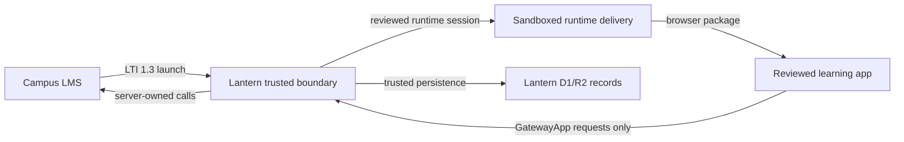

# Lantern Trust Model

Lantern is a governed app platform for institution-built and AI-built learning
apps.

The trust promise is simple:

> Lantern lets instructors create useful learning apps without asking campus IT
> to trust arbitrary app code with LMS credentials, databases, grade writes, or
> broad network access.

Lantern does this by making one approved LTI tool the trusted boundary. Apps run
as reviewed, versioned browser packages behind that boundary. Lantern owns the
launch, storage, grading, evidence, approval, deployment, and audit paths.

## Audience

This document is for campus IT, security reviewers, instructional technology
teams, and Lantern maintainers.

It explains what a Lantern app is allowed to do, what it cannot do, and which
parts of the system are trusted.

It is not a legal agreement, security certification, privacy policy, or
deployment runbook.

## Why This Exists

Instructors need small, course-specific learning tools: flashcards, matching
games, simulations, browser autograders, adaptive practice, and lightweight
reports.

Without a governed boundary, each tool becomes a new risk decision:

- another external app
- another LTI install
- another vendor review
- another data-flow diagram
- another path to grades or learner data

Lantern's answer is not to approve arbitrary generated software. Lantern's
answer is to approve one trusted platform boundary, then let reviewed learning
apps run inside that boundary with narrow capabilities.

## Trust Boundary

Lantern is the trusted integration boundary. Generated and instructor-built apps
are not trusted with platform power.

## LMS Incident Threat Model

Recent LMS security incidents have changed how campus IT evaluates connected
tools. In May 2026, Instructure publicly reported unauthorized activity in
Canvas and identified an access path tied to Free-For-Teacher accounts. The
U.S. Federal Student Aid security alert advised institutions to monitor system,
authentication, and Canvas integration logs for unusual access patterns.

Sources:

- [Instructure Security Incident Update](https://www.instructure.com/incident_update)
- [Federal Student Aid Technology Security Alert](https://fsapartners.ed.gov/knowledge-center/library/electronic-announcements/2026-05-12/technology-security-alert-ongoing-cybersecurity-incident-involving-canvas-learning-system)

Lantern does not claim to secure the LMS itself. Lantern improves the security
model for instructor-created apps by reducing how much trust each app needs from
the LMS.

| Threat after an LMS incident                                 | Lantern model                                                                                                                                  |
| ------------------------------------------------------------ | ---------------------------------------------------------------------------------------------------------------------------------------------- |
| LTI sprawl creates many integration review surfaces.         | One approved Lantern LTI boundary can launch many reviewed app versions.                                                                       |
| Small course tools ask for broad LMS trust to become useful. | App packages request narrow Gateway capabilities instead of LMS credentials.                                                                   |
| App code becomes a privileged integration layer.             | Generated code cannot receive raw LMS tokens, direct grade writes, database bindings, Worker code, or arbitrary outbound network access.       |
| Review evidence is scattered across tools and vendors.       | Lantern keeps package versions, validation, preview, approval, runtime, grading, and audit evidence together.                                  |
| Incident response depends on each tool's controls.           | Lantern's model supports version pinning, pending review, test launch, rejection, rollback, and unpublish controls from one platform boundary. |

Marketing language:

> Recent LMS incidents make the core security question unavoidable: how many
> tools should sit inside the LMS trust core? Lantern's answer is fewer. Let
> instructors create course-specific apps, but keep those apps behind one
> governed LTI boundary where launch, storage, grading, evidence, review, and
> audit stay under institutional control.

## What Apps Are

A Lantern app is a reviewed browser-first package.

Typical package files:

- `manifest.json`
- `dist/index.html`
- `dist/app.js`
- `dist/app.css`
- `content/activity.json`
- `preview/fixtures.json`
- `preview/tests.json`
- optional reviewed grading or evidence files for browser autograders

Each package version is immutable once reviewed. New changes become new
versions.

## What Apps Can Do

Apps can request only the capabilities declared in their manifest and approved
by Lantern review.

Current app-facing capabilities include:

- read launch context
- read reviewed activity content
- read and write attempt-local learner state through Lantern
- emit append-only attempt events through Lantern
- submit reviewed evidence artifacts through Lantern
- submit a score proposal through Lantern
- finalize an attempt through Lantern

Apps call these capabilities through `window.GatewayApp`. Lantern validates the
session, capability, payload, and runtime context before doing anything
durable.

The event model is Lantern-native. It borrows the useful discipline from SCORM,
xAPI, and cmi5 without exposing those runtimes to app code: attempt state is
session-scoped, learner actions are constrained answered/progressed/completed
records, and completion is finalized through Lantern.

## What Apps Cannot Do

Generated and reviewed app packages do not receive:

- raw LMS access tokens
- direct LMS API access
- SCORM runtime handles, xAPI/LRS credentials, cmi5 launch control, or arbitrary
  reporting endpoints
- direct grade-write authority
- direct D1 database access
- direct R2 bucket access
- Durable Object bindings
- Cloudflare Worker entrypoints
- arbitrary backend code
- arbitrary outbound HTTP
- `localStorage` or `sessionStorage` fallbacks
- package installs or remote imports

If an app needs storage, reporting, grading, or evidence, it must request those
through Lantern-owned Gateway APIs.

## Capability Model

Lantern treats capabilities as reviewable permissions.

Normal capabilities:

- read reviewed activity content
- save learner progress through Lantern local state
- record learner attempt events
- mark an attempt complete

Sensitive capabilities:

- submit score proposals
- submit evidence artifacts
- run reviewed browser grading checks

Blocked behaviors:

- external network access
- raw LMS API calls
- generated backend services
- direct database or object storage access
- direct grade passback
- Worker or Durable Object code authored by the app

The purpose is not to scare reviewers with ordinary progress tracking. The
purpose is to make the difference between normal learning telemetry, sensitive
grading behavior, and blocked platform access explicit.

## Generation Boundary

Lantern App Writer is a harness, not a magic prompt.

For generated apps, Lantern creates an initialized workspace that includes:

- starter files
- `AGENTS.md`
- SDK contract
- package contract
- style and design contracts
- validation contract
- Definition of Done
- selected examples
- instructor prompt

The model edits the generated app workspace. It does not edit the Lantern
product repository and does not author Cloudflare Worker code.

Before a generated app can be saved as a pending version, Lantern must prove:

- TypeScript passes when source files are present
- package validation passes
- policy validation passes
- pinned base styles are unchanged
- the Lantern app shell is preserved
- preview/runtime assertions pass
- no forbidden LMS, network, storage, Worker, or Durable Object code is present

If proof fails, Lantern feeds diagnostics back into the repair loop.

## Runtime Boundary

At runtime, Lantern creates an attempt-scoped session and serves reviewed
package assets through the reviewed runtime delivery path.

The app receives a signed bootstrap and can call only the Gateway APIs exposed
for that session and declared by the package manifest.

Lantern remains responsible for:

- LTI launch validation
- runtime session creation
- capability checks
- reviewed content delivery
- attempt-local state
- attempt events
- evidence storage
- score publication
- finalization
- audit records

The app renders the learner experience. Lantern owns the institution-facing
authority.

## LMS Boundary

Lantern is the LTI tool. Apps are not independent LTI tools.

That means:

- campus IT approves Lantern, not every generated package as a new LTI vendor
- Lantern stores exact LMS deployment records
- Lantern validates every launch against saved LMS setup
- Lantern owns Deep Linking returns
- Lantern owns grade publication
- Lantern owns LMS service-token use
- app packages never see LMS credentials

This is the central IT value: one governed integration boundary can support many
reviewed course-specific learning apps.

## Data Boundary

Lantern separates reviewed package data from learner runtime data.

Reviewed package data:

- immutable package files
- package manifest
- reviewed content files
- preview fixtures and tests
- validation and review evidence

Runtime learner data:

- launch/session records
- attempt-local state
- attempt events
- evidence artifacts
- finalization and scoring records
- audit events

Apps can ask Lantern to read or mutate runtime learner data only through
approved Gateway capabilities.

## Review Boundary

Generated apps do not become live because generation succeeded.

The normal path is:

1. Instructor requests an app.
2. Lantern creates a plan.
3. Lantern generates a workspace.
4. Lantern validates and previews the package.
5. Lantern saves a pending version.
6. A reviewer tests the pending version.
7. A reviewer approves or rejects it.
8. An approved version is pinned to LMS placements.

Review evidence should make these questions easy to answer:

- What was requested?
- What app was generated?
- What capabilities does it request?
- What data can it save?
- Can it affect grades?
- What validation and preview checks passed?
- Who approved it?
- Which version is live?

## Audit Boundary

Lantern should produce durable evidence for important actions:

- app generation started, repaired, failed, or succeeded
- package validation and preview results
- package import and review decisions
- LMS setup and launch events
- runtime capability calls
- attempt events
- finalization and grade publication
- deployment pinning, rollback, and unpublish actions

Audit records should be useful to administrators without exposing raw secrets,
tokens, or private infrastructure details.

## Failure Model

Lantern should fail clearly instead of silently degrading.

Examples:

- If a launch does not match saved LMS setup, Lantern rejects it.
- If an app requests a missing capability, Lantern blocks the call.
- If a generated package includes forbidden code, validation fails.
- If preview runtime assertions fail, the package is repaired or remains
  unsaved.
- If grade publication fails, Lantern records a bounded diagnostic and keeps
  evidence for retry or review.

This makes failures operationally visible without giving app code extra power.

## Non-Promises

Lantern does not promise that AI will always generate a good app on the first
try.

Lantern does not promise generated apps are pedagogically correct without human
review.

Lantern does not remove the need for campus privacy, accessibility, or security
review.

Lantern does not make arbitrary JavaScript safe. Lantern narrows what generated
JavaScript can become, validates it, previews it, and runs it behind a governed
gateway.

## Public Product Copy

Short version:

> Lantern gives instructors room to create course-specific learning apps while
> giving campus IT one governed LTI boundary for launch, storage, grading,
> review, and audit.

Security version:

> Generated apps in Lantern are reviewed browser packages. They do not receive
> LMS tokens, direct database access, direct grade-write authority, backend
> bindings, or arbitrary network access. Storage, grading, evidence, and LMS
> service calls stay behind Lantern's Gateway APIs.

Instructor version:

> Describe the learning app you want. Lantern builds it inside a reviewed
> template, tests it, saves it as a version, and lets you revise it before it is
> approved for LMS use.

IT version:

> Lantern reduces LTI sprawl. Instead of approving every instructor-created app
> as a separate external tool, institutions approve one governed platform that
> limits generated apps to reviewed package files and narrow Gateway
> capabilities.

## Acceptance Criteria For LANTERN-001

LANTERN-001 is complete when:

- The public repo contains a trust model that states Lantern's promise in plain
  language.
- The document distinguishes trusted Lantern platform code from reviewed app
  package code.
- The document lists what apps can do, what apps cannot do, and how Gateway
  capabilities are reviewed.
- The document explains why one governed LTI boundary is safer than one-off
  instructor tool installs.
- The document includes reusable product copy for instructors, IT reviewers, and
  security reviewers.
- The document avoids private deployment details, account identifiers, secrets,
  and internal strategy.
